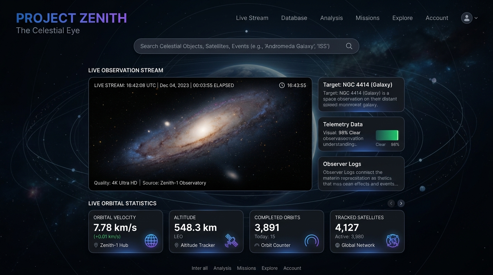
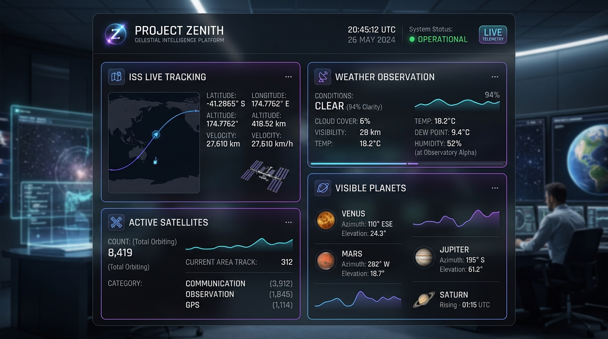
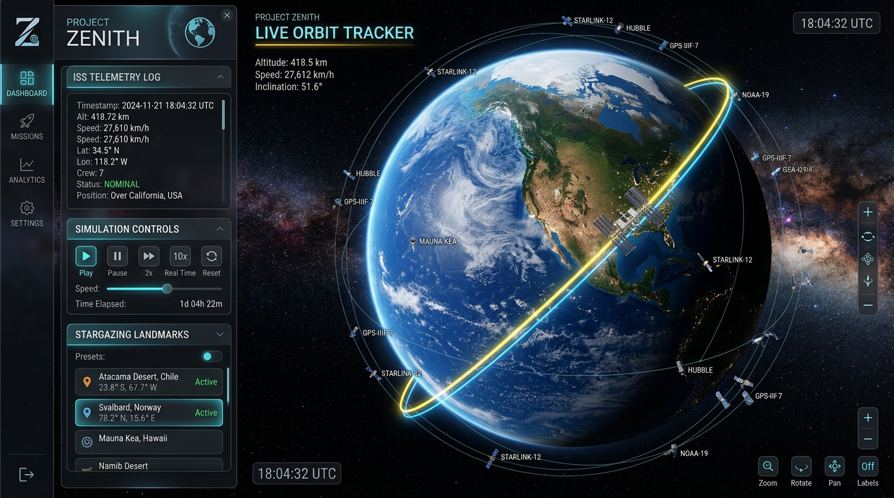
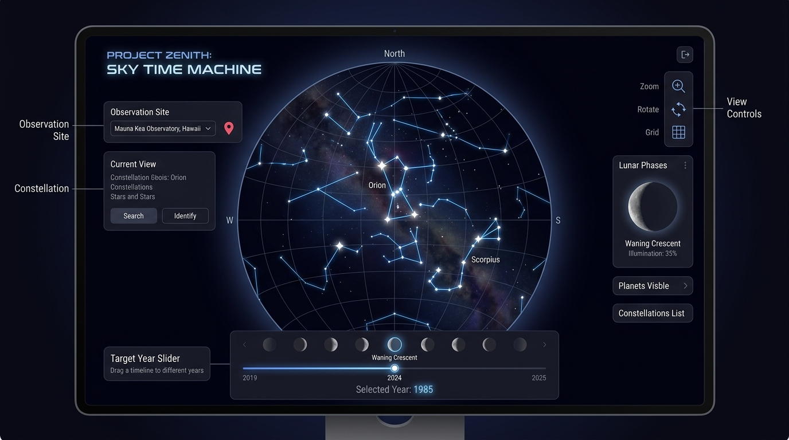

# Project Zenith: The Celestial Eye

**A real-time celestial tracking platform that visualizes astronomical data above any geographic coordinate on Earth.**

| | |
|---|---|
| **Team** | Mrunmayee Kokitkar, Sanika Chowdhary |
| **Competition** | AstralWeb Innovate — Round 2 |
| **Live Demo** | [mrunmayee-kokitkar-project-zenith.vercel.app](https://mrunmayee-kokitkar-project-zenith.vercel.app) |
| **Repository** | [github.com/sanikachowdhary/mrunmayee.kokitkar-project-zenith](https://github.com/sanikachowdhary/mrunmayee.kokitkar-project-zenith) |
| **Build Date** | 26 Jun 2026 |

---

## Problem Statement

Astronomers, educators, and space enthusiasts need a unified platform to answer a deceptively simple question: **what is happening in the sky directly above any point on Earth, right now?** Existing tools are fragmented — one app for ISS tracking, another for planet visibility, another for light pollution maps. None combine real-time orbital telemetry, historical sky reconstruction, and location-aware cosmic intelligence in a single, shareable interface.

**Project Zenith** solves this by fusing live satellite APIs, NASA ephemeris data, and interactive 3D visualization into one platform. Enter any city name or raw coordinates, and instantly see ISS position, visible planets, observation conditions, constellation overlays, and a Cosmic Twin Score for that exact location.

---

## Features

| Icon | Feature | Description |
|------|---------|-------------|
| 🌍 | **3D Globe** | CesiumJS-powered Earth with terrain, ISS orbit, satellite radar, and stargazing presets |
| 🛸 | **ISS Tracking** | Live position from OpenNotify API, refreshed every 30 seconds |
| 📡 | **ISS Pass Predictor** | Real-time pass predictions showing optimal viewing windows for your location |
| ⏳ | **Sky Time Machine** | Scrub ±100 years with bidirectional date/slider sync and Live/Historical/Future modes |
| 🔭 | **Cosmic Twin Engine** | Proprietary observation suitability score aggregating sky conditions per coordinate |
| 📍 | **Coordinate Challenge Mode** | Enter any lat/lng and load dashboard telemetry instantly |
| 🌌 | **Constellation Overlays** | Toggleable cyan constellation lines (Ursa Major, Orion, Cassiopeia) on the 3D globe |
| 📊 | **Dashboard** | Real-time telemetry panels with live UTC timestamps and shareable sky links |
| 🪐 | **APOD Display** | NASA's Astronomy Picture of the Day featured on homepage |
| 🌤️ | **Weather Integration** | Real-time cloud cover, atmospheric seeing, and transparency from Open-Meteo API |

---

## Tech Stack

| Layer | Technology |
|-------|-----------|
| Framework | **Next.js 16** (App Router) |
| Language | **TypeScript** |
| Styling | **TailwindCSS 4** |
| 3D Engine | **CesiumJS 1.142** (CDN + local assets) |
| Maps / Geocoding | **OpenStreetMap Nominatim** via server-side proxy |
| State Management | **Zustand-compatible location store** (`app/lib/api-client.ts`) |
| Animation | **Framer Motion** |
| Deployment | **Vercel** |

---

## External APIs

### 1. NASA Horizons API

| Field | Value |
|-------|-------|
| **Endpoint** | `https://ssd.jpl.nasa.gov/api/horizons.api` |
| **Purpose** | Planetary ephemeris and observer-target geometry for any lat/lng/date |
| **Parameters** | `format=json`, `COMMAND`, `EPHEM_TYPE=OBSERVER`, `SITE_COORD`, `START_TIME`, `STOP_TIME`, `STEP_SIZE` |
| **Proxy Route** | `GET /api/horizons?lat={lat}&lng={lng}&date={YYYY-MM-DD}` |
| **Cache** | 1 hour |

### 2. CelesTrak API

| Field | Value |
|-------|-------|
| **Endpoint** | `https://celestrak.org/NORAD/elements/gp.php?GROUP=active&FORMAT=json` |
| **Purpose** | Active satellite catalog for orbital density and tracking |
| **Parameters** | `GROUP=active`, `FORMAT=json` |
| **Proxy Route** | `GET /api/satellites` |
| **Cache** | 10 minutes |

### 3. OpenNotify API

| Field | Value |
|-------|-------|
| **Endpoint** | `http://api.open-notify.org/iss-now.json` |
| **Purpose** | Real-time International Space Station latitude/longitude |
| **Parameters** | None (returns `iss_position.latitude`, `iss_position.longitude`, `timestamp`) |
| **Proxy Route** | `GET /api/iss` |
| **Cache** | No cache (live polling every 5–30 seconds) |

### 4. OpenStreetMap Nominatim

| Field | Value |
|-------|-------|
| **Endpoint** | `https://nominatim.openstreetmap.org/search` |
| **Purpose** | Free geocoding — convert city names to coordinates |
| **Parameters** | `q={query}`, `format=json`, `limit=1` |
| **Proxy Route** | `GET /api/geocode?q={query}` |
| **Fallback** | Google Geocoding API if `GOOGLE_GEOCODING_API_KEY` is set |
| **Cache** | 1 hour |

### 5. Open-Meteo Weather API

| Field | Value |
|-------|-------|
| **Endpoint** | `https://api.open-meteo.com/v1/forecast` |
| **Purpose** | Real-time atmospheric conditions (cloud cover, seeing) for observation quality |
| **Parameters** | `latitude`, `longitude`, `hourly=cloudcover`, `current_weather=true` |
| **Proxy Function** | `fetchObservationConditions(lat, lng)` in `app/dashboard/_components/lib/real-api.ts` |
| **Cache** | No cache (live conditions) |
| **Features** | Cloud cover percentage, seeing index, atmospheric transparency |

### 6. NASA APOD API

| Field | Value |
|-------|-------|
| **Endpoint** | `https://api.nasa.gov/planetary/apod` |
| **Purpose** | NASA's daily Astronomy Picture of the Day with explanation |
| **Parameters** | `api_key={NASA_API_KEY}` |
| **Proxy Route** | `GET /api/apod` |
| **Cache** | 24 hours |
| **Environment** | `NASA_API_KEY` (optional; uses DEMO_KEY if not set) |

### 7. ISS Pass Prediction

| Field | Value |
|-------|-------|
| **Endpoint** | `https://api.open-notify.org/iss-pass.json` |
| **Purpose** | Calculates when ISS will be visible from a specific location |
| **Parameters** | `lat={latitude}`, `lon={longitude}` |
| **Proxy Route** | `GET /api/iss-passes?lat={lat}&lon={lon}` |
| **Cache** | No cache (predictions change by minute) |
| **Response** | Human-readable pass prediction (time, duration, elevation) |

---

## Installation & Setup

### Prerequisites

- **Node.js** 18+ (recommended: 20 LTS)
- **npm** 9+
- A **Cesium Ion** access token (optional, enables World Terrain)

### Environment Variables

Create `.env.local` in the project root:

```env
# Required for 3D terrain (optional but recommended)
NEXT_PUBLIC_CESIUM_ION_TOKEN=your_cesium_ion_token_here

# Optional: Google Geocoding fallback
GOOGLE_GEOCODING_API_KEY=your_google_api_key_here
```

### Step-by-Step Installation

```bash
# 1. Clone the repository
git clone https://github.com/sanikachowdhary/mrunmayee.kokitkar-project-zenith.git
cd mrunmayee.kokitkar-project-zenith

# 2. Install dependencies
npm install

# 3. Copy Cesium assets (runs automatically via predev/prebuild)
npm run predev

# 4. Start development server
npm run dev

# 5. Open in browser
# http://localhost:3000
```

### Build for Production

```bash
npm run build
npm start
```

---

## Project Structure

```
mrunmayee.kokitkar-project-zenith/
├── app/
│   ├── page.tsx                    # Homepage — hero, features, APOD display, location search
│   ├── layout.tsx                  # Root layout + NavBar
│   ├── globals.css                 # Cosmic theme, glass panels, scrubber styles
│   ├── components/
│   │   ├── NavBar.tsx              # Fixed navigation (desktop + mobile hamburger)
│   │   ├── LocationSearch.tsx      # Geocoding input with dropdown (improved scroll handling)
│   │   ├── SpaceEventStream.tsx    # Live ISS event feed (real API data)
│   │   ├── TimelineControls.tsx    # Sky Time Machine date/slider sync
│   │   ├── PresetButton.tsx        # Stargazing location presets
│   │   ├── ConstellationOverlay.tsx # Constellation lines + ISS orbit trail
│   │   └── APODDisplay.tsx         # NASA Astronomy Picture of the Day card
│   ├── lib/
│   │   ├── api-client.ts           # Shared location store (Zustand-compatible)
│   │   └── useLiveTimestamp.ts     # Live UTC clock hook (5s refresh)
│   ├── api/
│   │   ├── geocode/route.ts        # Nominatim + Google geocoding proxy
│   │   ├── horizons/route.ts       # NASA Horizons ephemeris proxy
│   │   ├── iss/route.ts            # OpenNotify ISS position proxy
│   │   ├── iss-passes/route.ts     # OpenNotify ISS pass predictor proxy
│   │   ├── satellites/route.ts     # CelesTrak active satellites proxy
│   │   └── apod/route.ts           # NASA APOD proxy
│   ├── globe/
│   │   ├── page.tsx                # 3D Cesium globe (Observatory Mode)
│   │   └── _components/
│   │       └── SpaceVisualizer.ts  # ISS orbit, radar satellites, constellations
│   ├── sky/
│   │   └── page.tsx                # Sky Time Machine (-100 to +100 years)
│   └── dashboard/
│       ├── page.tsx                # Data Intelligence Layer
│       ├── challenge/page.tsx      # Coordinate Challenge Mode
│       └── _components/
│           ├── DashboardLayout.tsx # Telemetry grid + share links
│           ├── TelemetryCard.tsx   # Reusable panel with timestamps
│           ├── cards/              # CosmicTwin, ISS, Planets, Satellites, Weather
│           └── lib/
│               └── real-api.ts     # Real API integration (ISS, satellites, APOD, weather)
├── public/
│   └── cesium/                     # CesiumJS runtime assets (auto-copied)
├── package.json
├── next.config.ts
└── README.md
```

---

## Features In Detail

### Homepage (`/`)

The landing page introduces Project Zenith with an animated particle background, shooting stars, and a location search bar. Searching for a city (e.g., "Pune", "London") or raw coordinates (e.g., `28.6139,77.2090`) geocodes via the server-side Nominatim proxy and navigates to the Dashboard with the resolved coordinates.

**New:** Featured APOD (Astronomy Picture of the Day) card displays NASA's daily cosmic image with description, date, photographer credit, and links to view full resolution.

### Globe Page (`/globe`)

The 3D Earth observatory powered by CesiumJS:

- **Night/Day Mode** — Toggle globe lighting for stargazing simulation
- **Mission Mode** — Gamified checklist (find ISS region, enable radar, fly to Everest)
- **Observatory Mode** — Live Space Event Stream + Simulation Timeline (hour offset ±24h)
- **Constellation Lines** — Toggle cyan overlays for Ursa Major, Orion, Cassiopeia
- **Orbit Trail** — Red polyline showing ~92-minute ISS orbital path
- **Stargazing Presets** — Mount Everest, Svalbard, Atacama, Pacific Ocean, Sahara Desert (camera looks UP at sky, not down at terrain)
- **Location Search** — Shared Zustand store updates all pages

### Sky Time Machine (`/sky`)

Travel through time to reconstruct any night sky:

- **Temporal scrubber** — ±100 years with year tick shortcuts
- **Temporal Offset** — Bidirectional sync between slider and date field
- **Mode labels** — Live Mode (±1 hour), Historical Mode (past), Future Mode (future)
- **Now button** — One-click reset to current UTC date/time
- **Canvas starfield** — Real-looking stars with magnitude-based sizing, horizon line, compass directions
- **Sky telemetry** — Sun altitude/azimuth, sidereal time, moon phase, visible planets
- **Atmospheric conditions** — Real-time cloud cover and transparency from Open-Meteo API

### Dashboard (`/dashboard`)

The Data Intelligence Layer loads immediately with real-time telemetry:

- **Cosmic Twin Score** — 0–100 observation suitability metric aggregating sky conditions
- **Observation Conditions** — Real-time cloud cover, atmospheric seeing, transparency from Open-Meteo API
- **Visible Planets** — Jupiter, Venus, Mars, Saturn with visibility percentages
- **ISS Telemetry** — Live lat/lng, altitude (~408 km), velocity (~27,600 km/h)
- **ISS Pass Prediction** — Next optimal viewing window with pass duration and elevation
- **Active Satellites** — Count from CelesTrak with notable elements list
- **Weather Integration** — Cloud cover %, seeing index, atmospheric transparency
- **Zenith Object** — Highlighted panel showing the celestial body directly overhead
- **Copy Sky Link** — Shareable URL: `/dashboard?lat=28.6139&lng=77.2090&t=2026-06-26T21:38:00Z`
- **Coordinate Challenge** — Link to `/dashboard/challenge` for manual coordinate entry
- **Real UTC Timestamps** — Live countdown timers and epoch displays

---

## API Integration Details

All external API calls are proxied through Next.js Route Handlers to avoid CORS issues, enable caching, and protect API keys. Client components call internal routes (`/api/iss`, `/api/geocode`, etc.) which forward to external services.

**Geocoding flow:**
1. User types "Pune" in LocationSearch
2. Client calls `GET /api/geocode?q=Pune`
3. Server tries Nominatim → returns `{ lat: 18.5204, lng: 73.8567, displayName: "Pune, ..." }`
4. Zustand store updates → all pages reflect new location

**ISS telemetry flow:**
1. SpaceEventStream polls `GET /api/iss` every 30 seconds
2. Server fetches `api.open-notify.org/iss-now.json`
3. Real timestamp + coordinates displayed in event feed
4. Dashboard ISS card polls every 5 seconds

**Horizons ephemeris flow:**
1. Dashboard calls `GET /api/horizons?lat=19.076&lng=72.8777&date=2026-06-26`
2. Server constructs Horizons observer query with site coordinates
3. Response cached for 1 hour
4. Zenith object computed from ephemeris + local geometry

---

## Testing Checklist

- [ ] Location search: "Pune" → ~18.5204, 73.8567 (not Mumbai)
- [ ] Location search: "London" → correct UK coordinates
- [ ] Location search: raw coords "28.6139,77.2090" → accepted
- [ ] All pages update when location changes via shared store
- [ ] Sky Time Machine: slider and date fields sync bidirectionally
- [ ] Sky Time Machine: mode label changes (Live / Historical / Future)
- [ ] Sky Time Machine: "Now" button resets to current UTC
- [ ] Dashboard: loads with visible data immediately (not empty)
- [ ] Dashboard: live timestamps update every 5 seconds
- [ ] Globe: Night Mode and Mission Mode toggles work
- [ ] Globe: Constellation lines visible (toggle on/off)
- [ ] Globe: ISS orbit trail visible (toggle on/off)
- [ ] Globe: Space Event Stream shows real ISS timestamps
- [ ] Globe: Navbar does not overlap controls
- [ ] Globe: Event Stream does not overlap Timeline
- [ ] Presets: Mount Everest → camera looks at sky above mountain
- [ ] Coordinate Challenge: enter coords → dashboard loads
- [ ] DevTools Network: calls to horizons, celestrak, open-notify
- [ ] Homepage: tagline "Open science..."
- [ ] Globe: "Observatory Mode" (not Bloomberg)
- [ ] Mobile 375px / 768px / 1024px responsive
- [ ] Copy Sky Link works and shared link loads correct state
- [ ] No console errors in DevTools

---

## Deployment

### Vercel (Recommended)

1. Push to GitHub
2. Import project in [vercel.com](https://vercel.com)
3. Add environment variables in Project Settings → Environment Variables
4. Deploy — Vercel auto-builds on every push to `main`

### Manual Deployment

```bash
npm run build
npm start
# Or deploy .next output to any Node.js host
```

**Production URL:** https://mrunmayee-kokitkar-project-zenith.vercel.app

---

## Troubleshooting

| Issue | Solution |
|-------|----------|
| Globe shows blank / loading forever | Check `NEXT_PUBLIC_CESIUM_ION_TOKEN` in `.env.local`; verify network access to cdn.jsdelivr.net |
| Location search returns wrong city | Ensure `/api/geocode` route is deployed; Nominatim requires User-Agent header (included in proxy) |
| ISS data shows "Reconnecting" | OpenNotify may be temporarily down; fallback message displays automatically |
| Dashboard panels empty on first load | Hard refresh; cached telemetry should appear within 1 second |
| CelesTrak / Horizons fetch fails at build | SSL certificate issues in CI — routes are dynamic (`ƒ`) and fetch at runtime |
| Mobile layout overlaps | Clear cache; NavBar collapses to hamburger below 768px |
| Cesium assets missing | Run `npm run predev` to copy Workers/Assets to `public/cesium/` |

---

## Team

**Mrunmayee Kokitkar** — Lead Developer, 3D Visualization, API Integration  
**Sanika Chowdhary** — UI/UX Design, Dashboard Architecture, Documentation

---

## Application Screenshots

Here are visual mockups of the Project Zenith interfaces across different screens:

### 1. Landing & Welcome Portal

*The home page featuring dynamic orbital telemetry and search capability.*

### 2. Telemetry Intelligence Dashboard

*Real-time data panels displaying ISS location, meteorological seeing, and visible planets.*

### 3. 3D Earth Orbit Observatory

*Interactive 3D Earth displaying ISS path, orbital tracks, and preset views.*

### 4. Sky Time Machine

*Historical and future sky reconstruction viewport displaying seasonal constellations.*

---

*Eyes up. Always.*

*Built for AstralWeb Innovate Round 2 — submitted 26 Jun 2026.*
